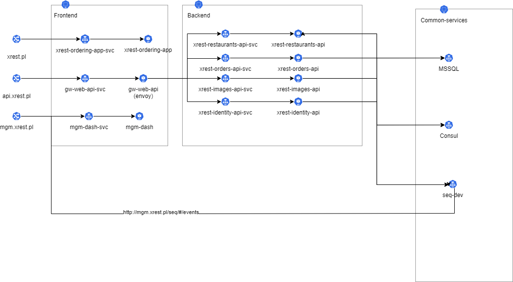
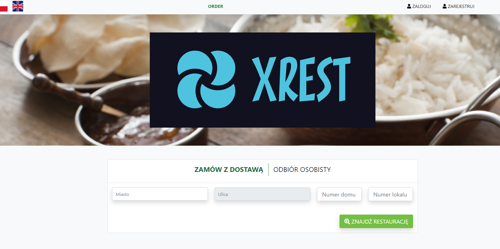

# xrest
Sample solution  with ordering foods on kubernetes

Diagram showing for this solution

## Tech stack

Technologies used to implement the solution:
- .net core 6 (minimal api)
- [svelte](https://svelte.dev/) used to make website
- nodejs used to make simple managment website
- [Envoy](https://www.envoyproxy.io/) used to make API gateway
- [Consul](https://www.consul.io/) used to key-value store and service discovery
- MSSQL
- [SEQ](https://datalust.co/seq) as logging system

This is a learning solution, not all functionalities have been fully activated, e.g. new user registration or login by fb/google.
However you can place an order and it will be saved to the database

Sample screen

